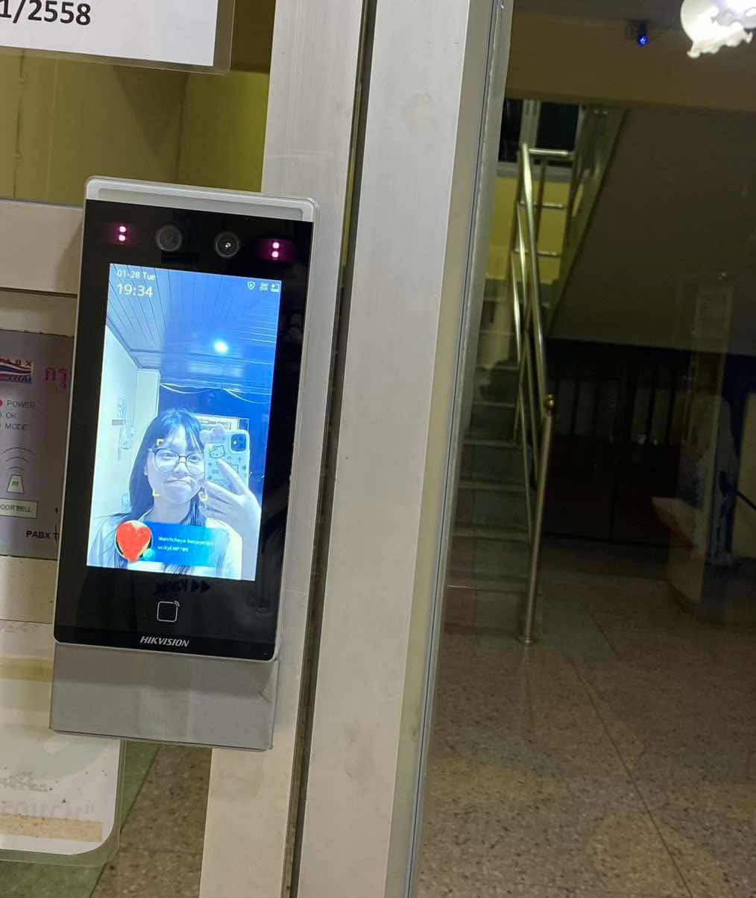

<h1>Security Control</h1>
<h2>Scan your face</h2>
<ul>
  <li>Location : หอพัก U-city</li>
  <li>Type of Security Controls : Technical Control</li>
  <li>Control Function : Preventative</li>
</ul>

  

    

      
    

    

      
    

  

<h2>Why is Technical preventive?</h2>

เพราะการสแกนหน้าเข้าห้องพักช่วยป้องกันปัญหาด้านความปลอดภัย เนื่องจากสามารถยืนยันตัวตนได้อย่างแม่นยำและปลอมแปลงได้ยาก ลดความเสี่ยงจากการสูญหายหรือขโมยบัตรผ่านหรือกุญแจ ทั้งยังช่วยป้องกันการเข้าถึงพื้นที่โดยไม่ได้รับอนุญาต ทำให้ระบบปลอดภัยและสะดวกยิ่งขึ้นสำหรับผู้ใช้งาน.

